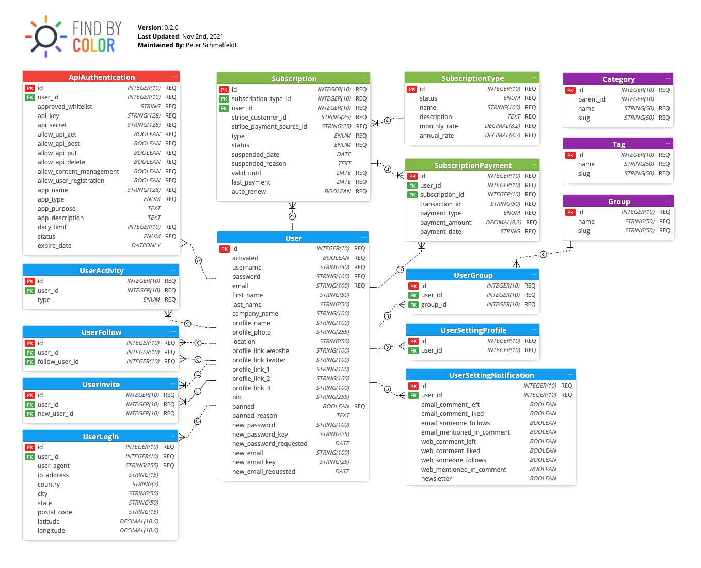

Find By Color - ORM Schema
===

> Find By Color Object Relational Mapping Schema - Create and Manage API Modules via Object Relational Mapping Schema Visual GUI.

Requirements
---

To use this project, you will need to download and install Meteor Modeler.

Project Structure
---

* **[api-models/](api-models/)** - Folder Containing Exported JavaScript API Models
* [find-by-color.dmm](find-by-color.dmm) - Project File for Meteor Modeler
* [schema.pdf](schema.pdf) - ORM Schema Export as PDF File

Updating
---

> If you are updating this repository, please make sure to complete the following:

1. Create a new `schema.png` file via a screen grab of Meteor Modeler
2. Use the `Export` button `*` in Meteor Modeler and replace `schema.pdf`
3. Generate New API Models by:
    * Click `ORM Script` in the Main Menu
    * Switch to the `MODULES` Tab
    * Make sure `Overwrite existing files` is toggled on in the bottom left corner of modal
    * Click the `SAVE MODULES` Button
    * Select the `./api-models` folders for the export
4. Perform a Cleanup & Repair of the API Models you created by running `npm run fix`
5. Submit a Pull Request for Review

`*` TIP: It will export the PDF to match the apps size, so shrink it to remove white space before doing the export
